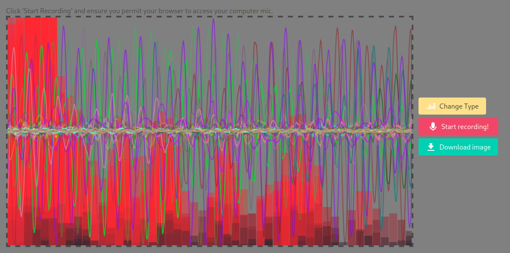

# mic-painter
Make trippy art with just your computer's mic!  [Try it out here!](https://mikebelanger.github.io/mic-painter/).

# Motivation
This is an experimental art tool. It's primary purpose is to allow users to create different kinds of abstract art with their voice.  Currently, members of [theSpace](https://thespaceottawa.ca) are testing it.  It's very WIP.

# To run locally
1. Make sure you have a recent version of npm installed, and a modern browser like Firefox or Chrome(ium).
2. Checkout this repo, cd into it.
3. `npm install` to get the deps.
4. `npm run dev` to start developing on a local server.
5. `npm run build` for a production bundle.
